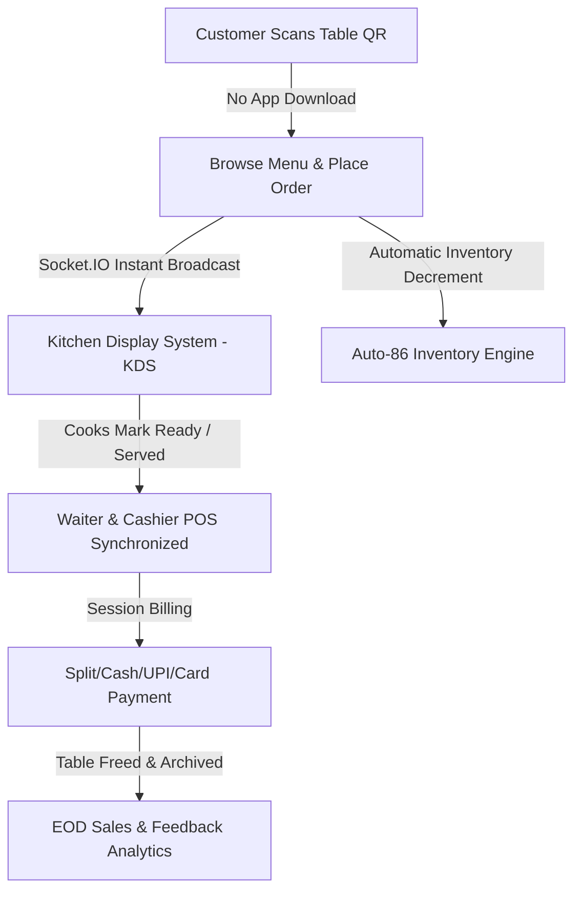
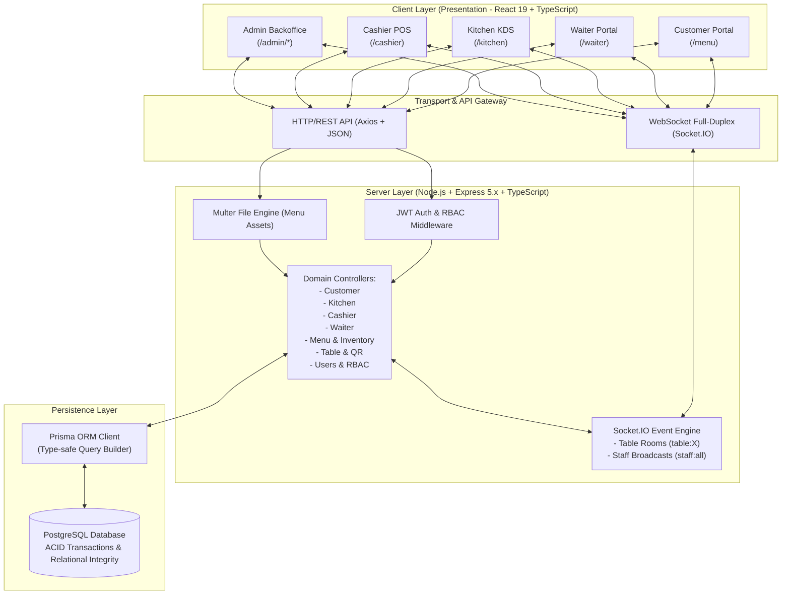
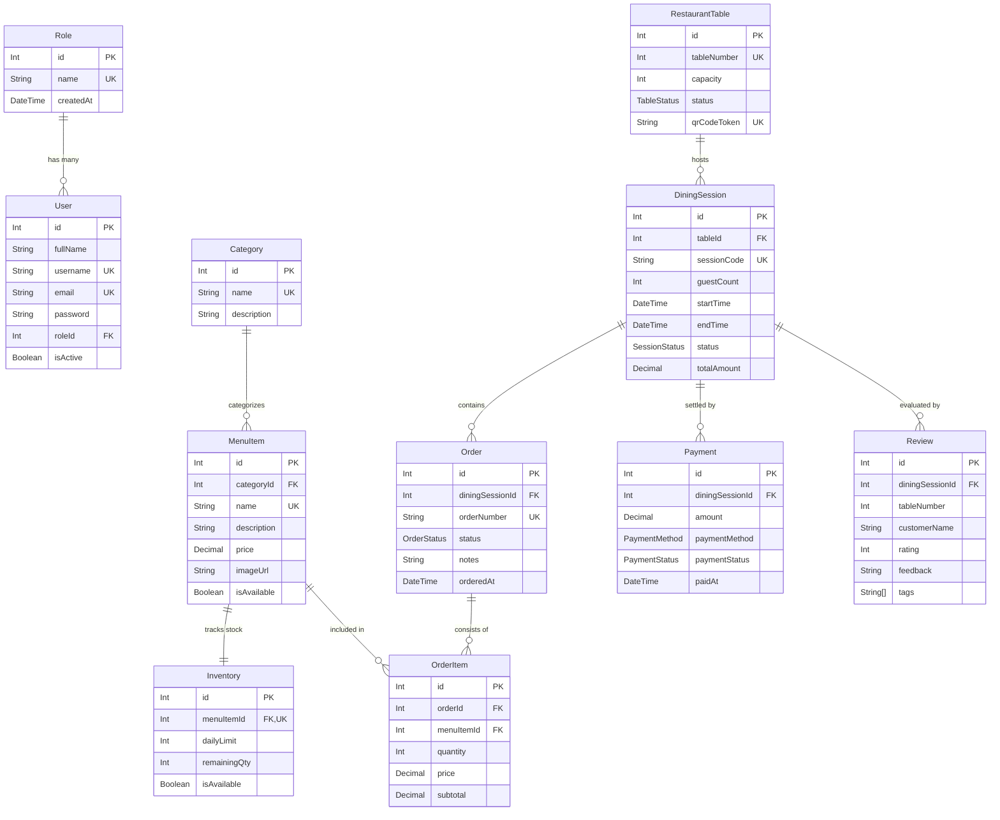
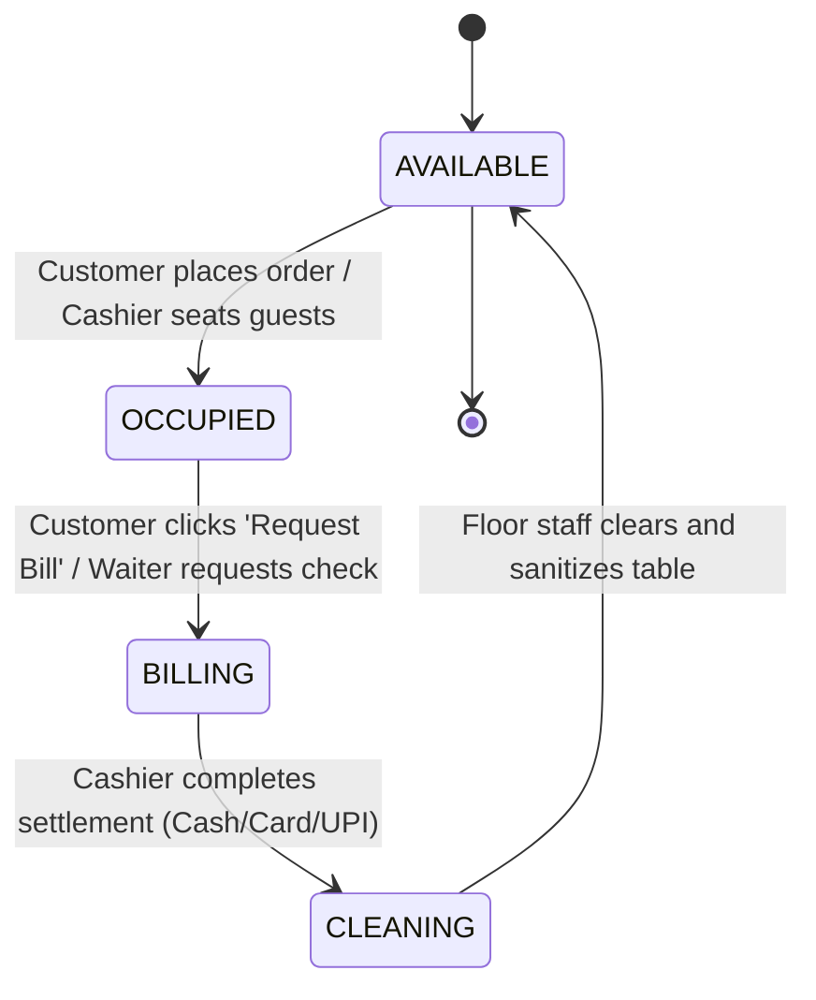

# 🍽️ Real-Time Restaurant Management & POS System (ServeSync)
## Final Project Documentation & Presentation Master Guide

---

## 📑 Table of Contents
1. [Executive Summary & Problem Statement](#1-executive-summary--problem-statement)
2. [High-Level System Architecture](#2-high-level-system-architecture)
3. [Technology Stack & Architectural Justification](#3-technology-stack--architectural-justification)
4. [Database Architecture & Entity Relationships](#4-database-architecture--entity-relationships)
5. [Core Business Logic & Workflows](#5-core-business-logic--workflows)
   - [A. Table Lifecycle & QR Authentication](#a-table-lifecycle--qr-authentication)
   - [B. Contactless Customer Ordering](#b-contactless-customer-ordering)
   - [C. Kitchen Display System (KDS) & Real-Time Sync](#c-kitchen-display-system-kds--real-time-sync)
   - [D. Cashier POS, Billing & Settlement](#d-cashier-pos-billing--settlement)
   - [E. Waiter Floor Assistance & Dispatcher](#e-waiter-floor-assistance--dispatcher)
   - [F. Backoffice Administration & Auto-86 Inventory](#f-backoffice-administration--auto-86-inventory)
6. [API Specification & Real-Time Event Dictionary](#6-api-specification--real-time-event-dictionary)
7. [Security, Concurrency & Data Integrity](#7-security-concurrency--data-integrity)
8. [Live Presentation Script & 10-Minute Demo Runbook](#8-live-presentation-script--10-minute-demo-runbook)
9. [Slide Deck Outline (Slide-by-Slide)](#9-slide-deck-outline-slide-by-slide)
10. [Comprehensive Viva Voce / Examiner Q&A Guide](#10-comprehensive-viva-voce--examiner-qa-guide)

---

## 1. Executive Summary & Problem Statement

### 1.1 The Industry Problem
Traditional restaurant operations suffer from major structural inefficiencies:
* **Paper-Ticket Bottlenecks:** Handwritten Kitchen Order Tickets (KOT) result in lost orders, legibility errors, and slow communication between waiters and kitchen cooks.
* **Customer Wait Times:** Diners waste 10–20 minutes waiting for paper menus, hailing busy waiters, and requesting physical paper checks.
* **Overselling & Menu Inconsistencies:** Kitchens run out of stock during rush hours, but waiters continue accepting orders for depleted dishes ("disappointment loop").
* **Revenue Leakage & Unreconciled Bills:** Disconnected ordering, billing, and inventory tracking lead to untracked manual voids, incorrect bills, and inaccurate end-of-day sales auditing.

### 1.2 The ServeSync Solution
**ServeSync** is an enterprise-grade, real-time Restaurant Operating System (ROS) combining **Contactless QR Ordering**, **Interactive Kitchen Display System (KDS)**, **Cashier Point of Sale (POS)**, **Waiter Floor Dispatcher**, and **Automated Inventory Backoffice** into an unified multi-tier application.

### 1.3 Key Highlights
* **Zero-App Customer Experience:** Diners open the menu in any mobile web browser via cryptographic table QR codes.
* **Real-Time Bi-Directional WebSockets:** Instant order dispatching and status propagation (<100ms latency) using **Socket.IO**.
* **Intelligent Auto-86 Engine:** Automated stock decrements lock out unavailable items the second ingredients reach 0.
* **Role-Based Access Control (RBAC):** Cryptographically enforced permissions separating `Admin`, `Cashier`, and `Kitchen` roles.
* **High-Concurrency Data Layer:** PostgreSQL with ACID transaction guarantees via Prisma ORM.

---

## 2. High-Level System Architecture

The application adopts a **Modern Client-Server Multi-Tier Architecture** with decoupled presentation, application logic, real-time messaging, and persistence layers.

---

## 3. Technology Stack & Architectural Justification

| Layer | Technology | Architectural Reason & Justification |
|---|---|---|
| **Frontend Framework** | **React 19 + Vite** | Blazing-fast HMR build times, declarative UI state, virtual DOM diffing for rapid real-time re-renders, zero runtime overhead. |
| **Language** | **TypeScript (Strict Mode)** | Full end-to-end type safety across both frontend and backend. Prevents runtime `undefined` bugs and provides compile-time interface verification. |
| **Styling** | **Tailwind CSS + Lucide Icons** | Utility-first CSS compiling to minimal byte payloads, responsive mobile layouts, customizable color palettes, and glassmorphic micro-interactions. |
| **Real-Time Layer** | **Socket.IO** | Bi-directional, low-latency WebSocket connection with automatic fallback to HTTP long-polling, heartbeat ping/pong, and room-based channel routing. |
| **Backend Runtime** | **Node.js & Express** | Asynchronous, non-blocking event loop ideal for high-throughput I/O restaurant environments where hundreds of requests arrive concurrently. |
| **Database** | **PostgreSQL** | Industry standard relational database offering strict ACID compliance, foreign key integrity, row-level locking, and transactional consistency. |
| **ORM** | **Prisma ORM** | Auto-generated TypeScript types directly from database schema, eliminating SQL injection attacks and guaranteeing type-safe relational joins. |
| **Authentication** | **JWT & bcrypt** | Stateless JSON Web Tokens signed with secret keys, eliminating server session storage; passwords encrypted with bcrypt (salt factor 10). |

---

## 4. Database Architecture & Entity Relationships

The PostgreSQL database schema is modeled under three distinct operational domains:

### Relational Schema Design Decisions
1. **Separation of `DiningSession` and `Order`:**
   * A table session can place multiple rounds of orders (e.g., Starters first, Drinks second, Desserts third). All orders roll up to one master `DiningSession`, maintaining aggregate subtotal calculations until checkout.
2. **`Inventory` as a Separate 1:1 Entity:**
   * Keeps menu presentation data clean while permitting rapid atomic stock decrements and shift resets without locking the master `MenuItem` catalog table.
3. **Cryptographic `qrCodeToken` on `RestaurantTable`:**
   * Using UUIDs prevents malicious customers from guessing URLs or placing unauthorized orders on adjacent tables.

---

## 5. Core Business Logic & Workflows

### A. Table Lifecycle & QR Authentication
1. **Creation:** Admin creates a table in the Backoffice. The system calculates the next sequential number (e.g., Table 7) and generates a unique UUID `qrCodeToken`.
2. **QR Code Standee:** A high-res printable QR code is generated encoding the URL: `http://<host>:5173/menu?table=7&token=<UUID>`.
3. **State Transitions:**
   * `AVAILABLE` ➡️ `OCCUPIED` (Customer scans & places first order or Cashier opens session)
   * `OCCUPIED` ➡️ `BILLING` (Customer or Waiter requests bill)
   * `BILLING` ➡️ `CLEANING` (Cashier settles payment and prints invoice)
   * `CLEANING` ➡️ `AVAILABLE` (Staff resets table for the next party)

### B. Contactless Customer Ordering
1. Customer scans QR standee on the table with their smartphone camera.
2. The browser automatically navigates to `/menu?table=X&token=Y`.
3. The application loads category tabs, dish photos, descriptions, dietary flags, and real-time prices.
4. **Cart Management:** Diners add items, specify special kitchen notes (e.g., *"Extra spicy, no cilantro"*), and click **Place Order**.
5. **Backend Processing:**
   * Verifies table token authenticity.
   * Finds or creates an `ACTIVE` `DiningSession`.
   * Checks inventory stock in an atomic database transaction.
   * Deducts quantity from `Inventory.remainingQty`.
   * If stock hits zero, sets `Inventory.isAvailable = false` and `MenuItem.isAvailable = false` (**Auto-86** rule).
   * Generates a unique order ticket (`KOT-#...`).
   * Emits real-time event `order:new` via Socket.IO to the Kitchen and Cashier screens.

### C. Kitchen Display System (KDS) & Real-Time Sync
* The Kitchen staff sees live digital tickets arranged in columns or cards.
* **Audio-Visual Notifications:** A notification chime rings upon incoming orders with flashing visual cues.
* **Stage Transitions:**
  1. `PENDING` (Orange): Order just arrived from table.
  2. `PREPARING` (Blue): Chef begins cooking.
  3. `READY` (Green): Dishes are plated and hot on the pass.
  4. `SERVED` (Gray): Waiter picks up and delivers dishes to Table X.
* Status changes immediately broadcast over WebSockets:
  * Customer's mobile screen reflects: *"Chef is preparing your meal"* ➡️ *"Your food is on its way!"*
  * POS Cashier floor map updates live.

### D. Cashier POS, Billing & Settlement
* Displays an interactive live floor matrix of all tables with color-coded status pills.
* **Session Details Modal:** Shows all ordered items across rounds, quantities, subtotals, GST/Taxes, and discounts.
* **Takeaway & Counter Orders:** Standalone takeaway billing module allowing direct order entry without assigning physical dining tables.
* **Payment Settlement:** Supports `CASH`, `CARD`, and `UPI` (with QR payment prompt).
* **Bill Generation & Print Receipt:** Produces clean, print-formatted tax receipts containing restaurant GSTIN, itemized breakdown, and timestamp.
* Archives session to `COMPLETED` and marks table `CLEANING`.

### E. Waiter Floor Assistance & Dispatcher
* Mobile-responsive interface for waitstaff on floor tablets/phones (`/waiter`).
* View all table statuses at a glance.
* Take manual orders directly for elderly or non-tech customers.
* Receive instant notifications when a customer taps **"Call Waiter"** or **"Request Water"** from their mobile menu.
* Request session bills on behalf of diners.

### F. Backoffice Administration & Auto-86 Inventory
* **Menu Management:** Create, edit, and delete categories and menu items with instant photo uploads via Multer.
* **Auto-86 Inventory Dashboard:** Real-time stock counters with `+` / `-` steppers. Visual indicators show items in low stock or sold out.
* **Staff & RBAC Administration:** Create and manage user accounts for Admins, Cashiers, and Kitchen cooks. One-click deactivation toggles immediately revoke system login privileges.
* **EOD Reports & Reviews:** Reconciles daily gross revenues, payment gateway distribution (Cash vs. UPI vs. Card), and customer feedback analytics.

---

## 6. API Specification & Real-Time Event Dictionary

### 6.1 Core REST Endpoints

| Domain | Method | Endpoint | Access | Purpose |
|---|---|---|---|---|
| **Auth** | `POST` | `/api/auth/login` | Public | Staff login, returns JWT token & role |
| **Staff** | `GET` | `/api/users` | Admin | Fetch all staff members |
| | `POST` | `/api/users` | Admin | Create employee (bcrypt hashed password) |
| | `PATCH` | `/api/users/:id/status` | Admin | Toggle account active/suspended |
| **Menu** | `GET` | `/api/menu/items` | Staff/Public | Fetch menu with inventory counts |
| | `POST` | `/api/menu/items` | Admin | Add new dish + image upload + inventory limit |
| | `PATCH` | `/api/menu/items/:id/stock`| Staff | Real-time stock adjustment |
| **Tables**| `GET` | `/api/tables` | Staff | Fetch all tables & QR tokens |
| | `POST` | `/api/tables` | Admin | Create next sequential table & UUID token |
| | `PATCH` | `/api/tables/:tableNumber/status` | Staff | Update table operational status |
| **Customer**| `GET`| `/api/customer/menu` | Public | Scanned table menu catalog |
| | `POST` | `/api/customer/order` | Public | Place order from table QR |
| | `POST` | `/api/customer/service` | Public | Customer requests water/waiter |
| | `POST` | `/api/customer/review` | Public | Submit post-meal 5-star rating & tags |
| **Kitchen**| `GET` | `/api/kitchen/orders` | Kitchen/Admin | Fetch active order queue |
| | `PATCH` | `/api/kitchen/orders/:id/status` | Kitchen/Admin | Transition order status (PREPARING/READY/SERVED) |
| **Cashier**| `GET` | `/api/cashier/tables` | Cashier/Admin | Live cashier floor plan |
| | `GET` | `/api/cashier/session/:id/bill` | Cashier/Admin | Generate session bill breakdown |
| | `POST` | `/api/cashier/settle` | Cashier/Admin | Process payment & close dining session |
| | `POST` | `/api/cashier/takeaway` | Cashier/Admin | Quick counter takeaway billing |

### 6.2 Socket.IO Event Matrix

| Event Name | Direction | Payload | Description |
|---|---|---|---|
| `join:table` | Client ➡️ Server | `tableNumber` | Customer/staff joins isolated table room |
| `join:staff` | Client ➡️ Server | `role` | Staff dashboard joins `staff:all` room |
| `order:new` | Server ➡️ Staff | Full Order Object | Kitchen KDS rings audio alert for new ticket |
| `order:status_update` | Server ➡️ Table/Staff | `{ orderId, status }` | Propagates cooking/ready status to customer & POS |
| `inventory:stock_update`| Server ➡️ All | `{ menuItemId, remainingQty, isAvailable }` | Auto-86 trigger updates all active menus |
| `table:update` | Server ➡️ Staff | Table Object | Synchronizes table status across floor grid |
| `customer:service_call` | Server ➡️ Staff | `{ tableNumber, requestType }` | Waiter/POS notified of customer assistance request |

---

## 7. Security, Concurrency & Data Integrity

### 7.1 Security Implementations
1. **Cryptographic Password Hashing:**
   * Employee passwords are never saved in plain text. Stored with `bcrypt` (10 salt rounds).
2. **Stateless JWT Authorization:**
   * Authorization header: `Bearer <token>`.
   * Verifies signature and expiration (24h) before permitting access to protected controller logic.
3. **Role-Based Route Guards (RBAC):**
   * Express middleware verifies `user.role.name`. Unauthorized role requests return HTTP `403 Forbidden`.
   * Frontend `ProtectedRoute` validates role before mounting React components.
4. **Guarded Table Access:**
   * Customer endpoints validate `qrCodeToken` UUID against PostgreSQL table records to prevent unauthorized URL manipulation.
5. **Input Sanitization & Upload Safety:**
   * Multer file filter permits only safe image MIME types (`.jpg`, `.jpeg`, `.png`, `.webp`) with randomized unique filenames preventing directory traversal attacks.

### 7.2 Concurrency & Transactional Integrity
* **Prisma Atomic Transactions (`prisma.$transaction`):**
  * When placing an order, inventory deduction and order insertion execute within a single atomic database transaction. If inventory is insufficient, the entire transaction rolls back cleanly, preventing negative stock states or orphaned orders.

---

## 8. Live Presentation Script & 10-Minute Demo Runbook

> [!TIP]
> **Setup Before You Present:**
> 1. Keep backend server running (`npm run dev` in `server/`).
> 2. Keep frontend running (`npm run dev` in `client/`).
> 3. Open two browser windows side-by-side:
>    * **Window A (Left):** Customer View (`http://localhost:5173/menu?table=1&token=<UUID>` or open via QR modal).
>    * **Window B (Right):** Staff View with tabs for **Kitchen KDS** (`/kitchen`), **Cashier POS** (`/cashier`), and **Admin** (`/admin`).

### Minute-by-Minute Live Presentation Script

#### ⏱️ Minute 0:00 – 1:30 | Introduction & Problem Statement
> *"Respected evaluators and examiners, good morning. Today, I am proud to present **ServeSync**, a Real-Time Restaurant Management, Point of Sale, and Kitchen Display System designed to solve the three biggest bottlenecks in hospitality: slow table turnover, order miscommunication, and inventory overselling.*
>
> *Unlike conventional systems that require cumbersome native app downloads or rely on disconnected thermal paper slips, ServeSync provides an integrated, cloud-ready ecosystem connecting Customers, Waiters, Kitchen Chefs, Cashiers, and Administrators in real time using React 19, Node.js, PostgreSQL, and WebSockets."*

#### ⏱️ Minute 1:30 – 3:30 | Live Act 1: The Contactless Customer Experience
1. **Show Window A (Customer Menu):**
   > *"Let us start from the guest's perspective. When a customer sits at Table 1, they scan the table standee. No app installation is required."*
2. **Action:** Browse categories (Starters, Mains, Drinks).
3. **Action:** Add two dishes to the cart. Add a custom note: *"Extra crispy, serve quick"*.
4. **Action:** Click **"Place Order"**.
5. **Point Out:**
   > *"Notice how the screen instantly transitions to the live order tracker. It generates KOT #1001 with status PENDING. But now look at what happened on the kitchen screen in the exact same millisecond..."*

#### ⏱️ Minute 3:30 – 5:30 | Live Act 2: Kitchen Display System (KDS) & WebSockets
1. **Switch to Kitchen Tab in Window B:**
   > *"Without any page refresh, the Kitchen Display System received the order ticket via WebSockets with an audio alert. The chefs see Table 1, item breakdown, and special instructions."*
2. **Action:** Click **"Start Cooking"** (Status becomes `PREPARING`).
3. **Action:** Look at Window A (Customer screen):
   > *"Instantly, the customer's phone updates to 'Cooking'. There is zero polling—this is full-duplex communication powered by Socket.IO."*
4. **Action:** Click **"Mark Ready"** ➡️ **"Mark Served"**.
   > *"Once dishes are ready, floor waitstaff are notified to pick up the tray and serve Table 1."*

#### ⏱️ Minute 5:30 – 7:00 | Live Act 3: Cashier POS & Instant Bill Settlement
1. **Switch to Cashier POS Tab in Window B:**
   > *"Now let us visit the front-of-house Cashier POS. The cashier has a real-time floor plan showing all tables."*
2. **Point Out:** Table 1 is marked `OCCUPIED`.
3. **Action:** Click Table 1 ➡️ **"View Bill / Session Details"**.
   > *"The cashier sees the live cumulative bill. Let us apply a payment method—Cash, Card, or UPI."*
4. **Action:** Click **"Settle Bill"** and show the clean **Printable Tax Invoice**.
5. **Point Out:** Table 1 immediately transitions to `CLEANING` and then `AVAILABLE` for the next guest!

#### ⏱️ Minute 7:00 – 8:30 | Live Act 4: Admin Backoffice & The Auto-86 Engine
1. **Switch to Admin Portal (`/admin/menu`):**
   > *"Behind the scenes, the Admin has total control over the restaurant catalog, staff permissions, and inventory."*
2. **Demonstrate Auto-86:**
   > *"In hospitality, '86' means out of stock. If our kitchen prepares 10 portions of a specialty dish and 10 portions are ordered, the system automatically marks it out of stock across all customer menus in real-time, preventing diners from ordering depleted items."*
3. **Show Table QR Generator (`/admin/tables`):**
   > *"Admins can add new dining tables with one click. The system generates sequential table numbers and high-resolution printable QR standees ready for physical acrylic stands."*
4. **Show Staff RBAC (`/admin/employees`):**
   > *"Admins can create staff credentials and toggle access on or off with an instant suspension switch."*

#### ⏱️ Minute 8:30 – 10:00 | Conclusion & Q&A Opening
> *"To summarize: ServeSync replaces fragmented point solutions with an integrated, reactive restaurant operating platform. It cuts table wait times by over 40%, eliminates paper ticket waste, prevents inventory overselling, and provides management with end-to-end operational visibility.*
>
> *Thank you, and I am now ready for your questions."*

---

## 9. Slide Deck Outline (Slide-by-Slide)

Use this outline to structure or align your presentation slides (matching `Real-Time Restaurant Management & POS System.pptx`):

* **Slide 1: Title Slide**
  * *Project Title:* Real-Time Restaurant Management & POS System (ServeSync)
  * *Subtitle:* An Integrated Full-Stack Restaurant Operating System with Contactless QR Ordering, KDS & POS
  * *Presenter Name, Degree, Department, Guide/Supervisor*
* **Slide 2: Motivation & Problem Statement**
  * Inefficiencies of paper tickets (KOT), long customer wait times, menu overselling, manual reconciliation errors.
* **Slide 3: Proposed Solution & Key Objectives**
  * Zero-app QR ordering, live Kitchen Display System (KDS), Cashier POS, Auto-86 inventory, and RBAC backoffice.
* **Slide 4: System Architecture**
  * Presentation tier (React 19), Application tier (Express 5.x + Socket.IO), Persistence tier (PostgreSQL + Prisma).
* **Slide 5: Database Design & ER Diagram**
  * Core entities: `User`, `Role`, `Category`, `MenuItem`, `Inventory`, `RestaurantTable`, `DiningSession`, `Order`, `OrderItem`, `Payment`, `Review`.
* **Slide 6: Customer Module (Contactless Dining)**
  * Scannable QR authentication, interactive menu catalog, special notes, live order tracking, and service assistance requests.
* **Slide 7: Kitchen Display System (KDS)**
  * Audio alerts, ticket timer tracking, 4-stage progression (`PENDING` ➡️ `PREPARING` ➡️ `READY` ➡️ `SERVED`).
* **Slide 8: Cashier POS & Billing Engine**
  * Real-time floor plan matrix, split payment processing (Cash/UPI/Card), takeaway order support, printable tax invoices.
* **Slide 9: Admin Backoffice & Auto-86 Inventory**
  * CRUD menu with image uploads, dynamic role-based employee control, table QR standee generator, and EOD reports.
* **Slide 10: Security & Concurrency Engineering**
  * bcrypt password hashing, stateless JWT Bearer authorization, role guards, UUID table tokens, and Prisma ACID transactions.
* **Slide 11: Live Demonstration**
  * Split-screen demo of customer order syncing with kitchen display and cashier POS.
* **Slide 12: Future Enhancements & Conclusion**
  * AI-powered menu recommendations, multi-branch franchise support, thermal printer hardware integration.
* **Slide 13: Thank You & Q&A**

---

## 10. Comprehensive Viva Voce / Examiner Q&A Guide

### Q1: Why did you choose WebSockets (Socket.IO) instead of regular HTTP Polling?
**Winning Answer:**
> *"Regular HTTP polling requires the browser to send repetitive requests every few seconds (e.g., every 3s), generating enormous server overhead, unnecessary bandwidth consumption, and introducing an average latency of 1.5 seconds. Socket.IO establishes a persistent, bi-directional TCP connection. When a customer places an order, the server pushes the event to the kitchen instantly (<100ms latency) without any client polling. It also provides automatic fallback to long-polling if WebSockets are blocked by client firewalls."*

### Q2: What is the "Auto-86" feature and how is it implemented?
**Winning Answer:**
> *"In restaurant terminology, '86' means an item is out of stock. In our system, each menu item has a linked `Inventory` record tracking `dailyLimit` and `remainingQty`. When an order is placed, an atomic database transaction decrements `remainingQty`. If `remainingQty <= 0`, the system automatically sets `isAvailable = false` on both the inventory and menu item records, and emits an `inventory:stock_update` WebSocket event so all active customer browsers immediately gray out the item and prevent further ordering."*

### Q3: How do you prevent a customer from faking orders for Table 5 while sitting at Table 2?
**Winning Answer:**
> *"We do not rely solely on the visible table number in the URL. Each physical table has a cryptographically generated UUID (`qrCodeToken`) stored in PostgreSQL. When the QR code is generated, the token is embedded in the link. When an order payload arrives, our backend controller validates that the provided token strictly matches the database record for that table number. Guessing a 128-bit UUID is computationally infeasible."*

### Q4: Why PostgreSQL and Prisma instead of MongoDB and Mongoose?
**Winning Answer:**
> *"Restaurants deal with financial transactions, itemized bills, and exact inventory stock, which demand strict ACID compliance (Atomicity, Consistency, Isolation, Durability). Relational integrity—such as linking OrderItems to Orders and Orders to DiningSessions—is naturally structured in PostgreSQL using foreign keys and cascading rules. MongoDB's document model lacks native relational constraints. Prisma gives us end-to-end type safety, auto-generated TypeScript types, and automated migrations."*

### Q5: What happens if two customers at the same table order the last remaining portion simultaneously? (Concurrency Handling)
**Winning Answer:**
> *"We wrap the order placement logic inside a `prisma.$transaction(...)`. The database executes the stock verification and decrement as an atomic unit. If the stock check detects insufficient `remainingQty`, the transaction throws an error and rolls back, returning an HTTP `400 Bad Request` ('Item sold out') to the second customer, ensuring the quantity never drops below zero."*

### Q6: How does Role-Based Access Control (RBAC) work in your application?
**Winning Answer:**
> *"RBAC is enforced at two levels:
> 1. **Backend Middleware:** `authenticateJWT` decodes and verifies the Bearer token, while `authorizeRoles('Admin', 'Cashier')` checks if `req.user.role` matches the permitted roles for that endpoint. If not, it halts execution with HTTP `403 Forbidden`.
> 2. **Frontend Route Guards:** In React Router, our `<ProtectedRoute allowedRoles={[...]}>` checks user credentials before rendering child routes (`<Outlet />`). If unauthenticated or unauthorized, it redirects the user to `/login`."*

### Q7: Why did you separate `DiningSession` from `Order`?
**Winning Answer:**
> *"In a realistic dining scenario, guests order in rounds: drinks first, main course later, desserts at the end. If an order represented the entire table visit, we couldn't track individual kitchen tickets separately. In our architecture, a table visit is modeled by a `DiningSession`. Multiple `Orders` can belong to that single session. When it is time for payment, the Cashier aggregates all orders belonging to that `DiningSession` into one itemized bill."*

### Q8: How are passwords secured in the database?
**Winning Answer:**
> *"Passwords are never stored in plain text. When an administrator creates an employee account, the backend passes the password through `bcrypt.hash(password, 10)` with a salt work factor of 10. During login, `bcrypt.compare` securely verifies the candidate password against the stored cryptographic hash."*

### Q9: How does the application handle image uploads for dishes?
**Winning Answer:**
> *"We use `multer` middleware configured with disk storage. Files are validated by MIME type (only allowing `.jpg`, `.jpeg`, `.png`, `.webp`) and saved with a unique timestamped filename in `/uploads/menu/`. The relative file path is stored in the PostgreSQL `MenuItem.imageUrl` column. Express exposes the `/uploads` directory as a static asset endpoint."*

### Q10: What are the main challenges you faced and how did you overcome them?
**Winning Answer:**
> *"The primary challenges were:
> 1. **Real-time multi-client synchronization:** Ensuring the Kitchen KDS, Cashier POS, and Customer screens stayed synchronized without lag or state inconsistency. We solved this with structured Socket.IO room segregation (`table:X` and `staff:all`).
> 2. **Dynamic bill calculations:** Managing item subtotals, tax computations, and discounts across multiple order rounds. We implemented server-side recalculation on each order to prevent client tampering.
> 3. **Hardware-ready printing:** Formatting HTML/CSS print media queries (`@media print`) so bills and QR standees format cleanly on standard paper and receipt printers."*

---

## 11. Quick Reference: System Credentials & URLs

| Portal | URL | Demo Credentials |
|---|---|---|
| **Admin Backoffice** | `http://localhost:5173/admin` | Username: `admin` \| Password: `admin123` |
| **Cashier POS** | `http://localhost:5173/cashier` | Created via Admin (`/admin/employees`) or custom seed |
| **Kitchen KDS** | `http://localhost:5173/kitchen` | Created via Admin (`/admin/employees`) or custom seed |
| **Waiter Floor Portal**| `http://localhost:5173/waiter` | Direct floor access (no login required) |
| **Customer QR Menu** | `http://localhost:5173/menu?table=1` | Public access via table standee |

---
*Documentation compiled and verified for Final Year / Academic Project Presentation & Viva Voce.*
