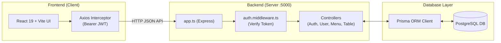

# 🎓 Restaurant Management & POS System (Serve_Sync)
## Complete Beginner-Friendly Codebase & Architecture Guide

---

## 🧭 Table of Contents
1. [The 10,000-Foot Architecture Overview](#1-the-10000-foot-architecture-overview)
2. [Database Schema (`schema.prisma`) Explained Line-by-Line](#2-database-schema-schemaprisma-explained-line-by-line)
3. [Server Core (`server/src/app.ts`)](#3-server-core-serversrcappts)
4. [Backend Security & Uploads (`middleware/`)](#4-backend-security--uploads-middleware)
5. [Backend Controllers & Routes (`controllers/`)](#5-backend-controllers--routes-controllers)
   - [Auth Controller](#auth-controller-authcontrollerts)
   - [User & RBAC Controller](#user--rbac-controller-usercontrollerts)
   - [Menu & Inventory Controller](#menu--inventory-controller-menucontrollerts)
   - [Table & QR Controller](#table--qr-controller-tablecontrollerts)
6. [Frontend Client Core (`client/src/`)](#6-frontend-client-core-clientsrc)
   - [Routing & Security (`App.tsx` & `ProtectedRoute.tsx`)](#routing--security-apptsx--protectedroutetx)
   - [Axios HTTP Interceptor (`axiosInstance.ts`)](#axios-http-interceptor-axiosinstancets)
   - [Layout & Navigation (`AdminLayout.tsx` & `AppSidebar.tsx`)](#layout--navigation-adminlayouttsx--appsidebartsx)
7. [Frontend Pages Breakdown](#7-frontend-pages-breakdown)
   - [Login Page (`Login.tsx`)](#1-login-page-logintsx)
   - [Menu & Auto-86 Inventory (`MenuInventory.tsx`)](#2-menu--auto-86-inventory-menuinventorytsx)
   - [Staff & Permissions (`Employees.tsx`)](#3-staff--permissions-employeestsx)
   - [Floor Plan & QR Standees (`TablesQR.tsx`)](#4-floor-plan--qr-standees-tablesqrtsx)
   - [EOD & Feedback Staging (`Reports.tsx`)](#5-eod--feedback-staging-reportstsx)
8. [Examiner Q&A Cheat Sheet](#8-examiner-qa-cheat-sheet)

---

## 1. The 10,000-Foot Architecture Overview



### What happens when you click something on the screen?
1. **User Action**: You click a button (e.g. "Add Table" with 4 seats).
2. **Frontend Call**: React uses `axiosInstance.post('/tables', { capacity: 4 })`.
3. **VIP Pass Attached**: The Axios interceptor automatically attaches your `token` in the headers.
4. **Server Receives Request**: `app.ts` directs the request to `tableRoutes` ➡️ `table.controller.ts`.
5. **Database Operation**: Prisma converts the JavaScript instruction into SQL: `INSERT INTO "RestaurantTable" ...`.
6. **Response**: The database confirms the row is saved. The server sends back HTTP `201 Created` with the new table object.
7. **State Update**: React updates its state array, and the new table appears on screen instantly without a full page reload.

---

## 2. Database Schema (`schema.prisma`) Explained Line-by-Line

The file [server/prisma/schema.prisma](file:///d:/Development/Restaurant-Management-System/server/prisma/schema.prisma) defines your database tables and their relationships.

### Domain 1: Access Control & Staff
* **`Role`**:
  * `id`: Unique identifier (1, 2, 3...).
  * `name`: Name of the role (`Admin`, `Cashier`, `Kitchen`).
  * `users User[]`: A 1-to-many relationship: One role has multiple employees assigned to it.
* **`User`**:
  * `fullName`: Name of employee (e.g., "Ambadi KJ").
  * `username` & `email`: Unique login credentials.
  * `password`: The bcrypt hashed string (never stored in plain readable text).
  * `roleId`: Foreign key pointing to `Role.id`.
  * `isActive`: Boolean (`true`/`false`). If an employee resigns or is suspended, an admin toggles this to `false` to revoke login privileges without deleting past sales records.

### Domain 2: Menu & Auto-86 Inventory
* **`Category`**: E.g., "Starters", "Mains", "Drinks". One category has many `menuItems`.
* **`MenuItem`**:
  * `name`, `description`, `price`: Item details.
  * `imageUrl`: Local disk path to the food image saved by Multer (defaults to `uploads/menu/default-food.png`).
  * `isAvailable`: Boolean. Tells the customer ordering menu whether to display or hide the item.
* **`Inventory`**:
  * `dailyLimit`: The target quantity prepared by the kitchen at the start of the shift (e.g., 30 steaks).
  * `remainingQty`: The live counter. Decreases with every order.
  * **Auto-86 Mechanism**: In the restaurant industry, "86" means an item is out of stock. When `remainingQty` drops to `0`, `isAvailable` automatically becomes `false`.

### Domain 3: Restaurant Floor & Dining Sessions
* **`RestaurantTable`**:
  * `tableNumber`: The physical number printed on the table (1, 2, 3...).
  * `capacity`: Maximum guest count (e.g., 2, 4, 6, 8 seats).
  * `status`: `AVAILABLE`, `OCCUPIED`, `BILLING`, or `CLEANING`.
  * `qrCodeToken`: A unique, unguessable UUID. This token is encoded in the QR standee so guests can only place orders for the table they are seated at.
* **`DiningSession`**:
  * Represents an active group seated at a table.
  * Tracks `startTime`, `endTime`, `status` (`ACTIVE`/`COMPLETED`), and accumulated `totalAmount`.

---

## 3. Server Core (`server/src/app.ts`)

File: [server/src/app.ts](file:///d:/Development/Restaurant-Management-System/server/src/app.ts)

```typescript
const app = express();
app.use(cors());
app.use(express.json());
app.use("/uploads", express.static(path.join(process.cwd(), "uploads")));
```

* **`express()`**: Creates the web server instance.
* **`cors()`**: Stands for *Cross-Origin Resource Sharing*. Allows your frontend running on `http://localhost:5173` to safely send API requests to port `5000`.
* **`express.json()`**: Middleware that translates incoming JSON payloads into JavaScript objects accessible via `req.body`.
* **`express.static(...)`**: Tells the server that the `/uploads` URL points directly to the `uploads/` folder on your hard drive, allowing images to load in the browser.

### Route Mounting:
```typescript
app.use("/api/auth", authRoutes);    // Handles /api/auth/login
app.use("/api/users", userRoutes);    // Handles staff & role management
app.use("/api/menu", menuRoutes);     // Handles categories, dishes, and inventory
app.use("/api/tables", tableRoutes);  // Handles tables & QR codes
```

---

## 4. Backend Security & Uploads (`middleware/`)

### A. JWT Auth Middleware (`server/src/middleware/auth.middleware.ts`)
* **What it does**: Acts as a security checkpoint before any protected controller runs.
* **How it works**:
  1. Inspects `req.headers.authorization`.
  2. Extracts the Bearer token: `Bearer eyJhbGci...`.
  3. Validates the digital cryptographic signature using `jwt.verify(token, JWT_SECRET)`.
  4. If verified, attaches the decoded user data (`id`, `username`, `role`) to `req.user` and calls `next()`.
  5. If the token is missing, expired, or tampered with, it blocks the request with HTTP `401 Unauthorized`.

### B. Multer File Upload Middleware (`server/src/middleware/upload.middleware.ts`)
* **What it does**: Handles image file uploads when creating dishes.
* **How it works**:
  1. `destination`: Sets the save folder to `server/uploads/menu/`.
  2. `filename`: Generates a timestamp-based unique filename (`Date.now() + path.extname(...)`) so uploaded files never clash or overwrite each other.
  3. `fileFilter`: Rejects any file that is not a valid image format (`.jpg`, `.jpeg`, `.png`, `.webp`).

---

## 5. Backend Controllers & Routes (`controllers/`)

Controllers contain the **business logic**—they take requests, query the database via Prisma, and return responses.

### Auth Controller (`auth.controller.ts`)
* **`login(req, res)`**:
  1. Grabs `username` and `password` from `req.body`.
  2. Queries the database: `prisma.user.findUnique({ where: { username }, include: { role: true } })`.
  3. Checks `user.isActive`. If `false`, rejects with *"Account is deactivated"*.
  4. Compares the plain-text password with the stored hash: `bcrypt.compare(password, user.password)`.
  5. If matched, generates a **JWT token** with a 24-hour expiration containing user details.
  6. Returns the token and user summary.

### User & RBAC Controller (`user.controller.ts`)
* **`getRoles`**: Returns all available roles (`Admin`, `Cashier`, `Kitchen`) to populate the frontend dropdown when adding staff.
* **`getUsers`**: Returns all employees with their role name, intentionally excluding password hashes for security.
* **`createUser`**: Hashes the initial password with `bcrypt.hash(password, 10)` before inserting the user into PostgreSQL.
* **`updateUser`**: Updates an employee's full name, email, or role, and optionally hashes a new password if one was supplied.
* **`toggleUserStatus`**: Inverts `user.isActive` (from active to suspended or vice-versa).
* **`deleteUser`**: Deletes a user account from the system.

### Menu & Inventory Controller (`menu.controller.ts`)
* **`getCategories` & `createCategory`**: Manages menu sections.
* **`getMenuItems`**: Fetches dishes and includes their associated `inventory` record (`dailyLimit`, `remainingQty`).
* **`createMenuItem`**:
  * Extracts dish information and the uploaded image path.
  * In a single atomic Prisma transaction (`prisma.$transaction`), it creates the `MenuItem` and creates its corresponding `Inventory` row with the initial stock count.
* **`updateStock`**:
  * Modifies `remainingQty`.
  * If `remainingQty <= 0`, it automatically flips `isAvailable = false` (**Auto-86** rule).
* **`toggleItemAvailability`**: Allows an admin or kitchen chef to manually toggle an item between available and unavailable.

### Table & QR Controller (`table.controller.ts`)
* **`getTables`**: Returns all tables sorted in ascending order by table number.
* **`createTable`**:
  * Finds the highest existing table number and increments it by 1 (e.g. Table 4 ➡️ Table 5).
  * Automatically assigns a fresh `crypto.randomUUID()` as the table's `qrCodeToken`.
  * Saves table number, capacity, and default status `AVAILABLE`.
* **`updateTableStatus`**: Updates the table's live state (`AVAILABLE`, `OCCUPIED`, `BILLING`, `CLEANING`).
* **`deleteTable`**: Removes a table from the floor plan.

---

## 6. Frontend Client Core (`client/src/`)

### Routing & Security (`App.tsx` & `ProtectedRoute.tsx`)
* [App.tsx](file:///d:/Development/Restaurant-Management-System/client/src/App.tsx):
  * Sets up React Router (`<BrowserRouter>`).
  * `/login` renders the public login screen.
  * `/admin` is wrapped inside [ProtectedRoute.tsx](file:///d:/Development/Restaurant-Management-System/client/src/components/ProtectedRoute.tsx).
* [ProtectedRoute.tsx](file:///d:/Development/Restaurant-Management-System/client/src/components/ProtectedRoute.tsx):
  * Inspects `localStorage.getItem("token")`.
  * If no token exists, the user is redirected immediately to `/login`.
  * If `allowedRoles` are specified (e.g. `['Admin']`), it verifies `user.role`. If unauthorized, it boots the user out.
  * If valid, it renders `<Outlet />` to allow child routes to load.

### Axios HTTP Interceptor (`axiosInstance.ts`)
* File: [client/src/api/axiosInstance.ts](file:///d:/Development/Restaurant-Management-System/client/src/api/axiosInstance.ts)
* Sets `baseURL: "http://localhost:5000/api"`.
* Registers a request interceptor:
  ```typescript
  axiosInstance.interceptors.request.use((config) => {
    const token = localStorage.getItem("token");
    if (token) config.headers.Authorization = `Bearer ${token}`;
    return config;
  });
  ```
  * Every single API request automatically sends the Bearer JWT token in the header without having to write it manually on each page.

### Layout & Navigation (`AdminLayout.tsx` & `AppSidebar.tsx`)
* [AdminLayout.tsx](file:///d:/Development/Restaurant-Management-System/client/src/components/AdminLayout.tsx):
  * Wraps the admin portal with a responsive sidebar and a top sticky header bar.
  * The top bar features the active page title, subtitle, and the live status pill (`WS: SYNCED`).
  * Features the `<Outlet />` where the active module's page component renders.
* [AppSidebar.tsx](file:///d:/Development/Restaurant-Management-System/client/src/components/AppSidebar.tsx):
  * Renders the left navigation panel with `ChefHat` brand icon and links:
    1. **Menu & Auto-86** (`/admin/menu`)
    2. **Staff & RBAC** (`/admin/employees`)
    3. **QR Endpoints** (`/admin/tables`)
    4. **EOD & Reviews** (`/admin/reports`)
  * Displays user avatar initials and role.
  * Includes the **Logout** button: clears `token` and `user` from `localStorage` and navigates to `/login`.

---

## 7. Frontend Pages Breakdown

### 1. Login Page (`Login.tsx`)
* File: [client/src/pages/Login.tsx](file:///d:/Development/Restaurant-Management-System/client/src/pages/Login.tsx)
* **Visual Structure**: Split landscape card.
  * **Left Panel**: Clean minimalist brand identity with `ChefHat` logo, "Sign in" heading, and "Restaurant Management & POS System" subtitle.
  * **Right Panel**: Form with `username` and `password` input fields, with icons (`User`, `Lock`).
* **Interactive State**:
  * `username` & `password`: Stores typed text.
  * `isLoading`: Toggles button to a spinning loader state while the backend responds.
  * `error`: Renders a red alert banner if credentials fail.
* **Login Action**:
  * Calls `POST /api/auth/login`.
  * Saves JWT token and user info to `localStorage`.
  * Navigates user to `/admin` (which redirects to `/admin/menu`).

### 2. Menu & Auto-86 Inventory (`MenuInventory.tsx`)
* File: [client/src/pages/admin/MenuInventory.tsx](file:///d:/Development/Restaurant-Management-System/client/src/pages/admin/MenuInventory.tsx)
* **Category Filter Tabs**: Dynamically generated tabs for filtering dishes by category.
* **Dish Cards**:
  * Food image preview (or fallback placeholder).
  * Price formatting (`$XX.XX`).
  * Category badge.
  * Live inventory pill: 🟢 **In Stock** vs. 🔴 **Sold Out (Auto-86)**.
* **Interactive Stock Stepper**: `+` and `-` buttons on each card dispatch stock updates to `/api/menu/items/:id/stock` in real time.
* **Modals**:
  * *Add Category Modal*: For organizing new menu sections.
  * *Add Menu Item Modal*: Form supporting name, category dropdown, price, daily preparation portion limit, and photo attachment (`FormData`).

### 3. Staff & Permissions (`Employees.tsx`)
* File: [client/src/pages/admin/Employees.tsx](file:///d:/Development/Restaurant-Management-System/client/src/pages/admin/Employees.tsx)
* **RBAC Filter Tabs**: Allows viewing `ALL`, `ADMIN`, `CASHIER`, or `KITCHEN` staff accounts with count badges.
* **Search Filter**: Instant client-side search across name, username, and email.
* **Staff Table**:
  * Displays user avatar initials, full name, email, and role badge.
  * Status badge: 🟢 `ACTIVE` vs. 🔴 `INACTIVE`.
  * **Quick Status Toggle**: Admins can suspend or activate staff with one click.
  * **Action Buttons**: Edit credentials, reset password, or delete user.

### 4. Floor Plan & QR Standees (`TablesQR.tsx`)
* File: [client/src/pages/admin/TablesQR.tsx](file:///d:/Development/Restaurant-Management-System/client/src/pages/admin/TablesQR.tsx)
* **Add Table Button (Black)**: Prompts a modal that detects the next sequential table number and lets the admin select seat capacity (2, 4, 6, 8 seats).
* **Live Table Matrix**:
  * Visual cards for each table with seating capacity icon.
  * Status badges: 🟢 `Available`, 🔵 `Occupied`, 🟡 `Billing`, 🟣 `Cleaning`.
  * Status switcher dropdown for immediate floor updates.
* **Printable QR Standee Modal**:
  * When clicking the QR button on any table, a modal opens displaying a high-resolution scannable QR code encoded with the table's unique URL (`http://.../menu?table=X`).
  * Features a **"Print Standee"** button that opens the system print dialog, formatted for physical acrylic table stands!

### 5. EOD & Feedback Staging (`Reports.tsx`)
* File: [client/src/pages/admin/Reports.tsx](file:///d:/Development/Restaurant-Management-System/client/src/pages/admin/Reports.tsx)
* **Purpose**: Staging interface for daily End-of-Day revenue reconciliation and customer feedback analytics.
* **Pulsing Skeleton Loader**:
  * Uses the `Skeleton` component to render an animated preview state:
    * *Settlement by Gateway*: Cash vs. UPI vs. Card breakdown.
    * *Tax & KOT Reconciliation*: Order ticket counts and GST audit status.
    * *Customer Satisfaction*: 5-star ratings index and review volume.
    * *Audit Table*: 5 animated placeholder rows demonstrating transaction logs.

---

## 8. Examiner Q&A Cheat Sheet

| Question | Winning Answer |
|---|---|
| **Why use PostgreSQL with Prisma?** | *"PostgreSQL guarantees ACID-compliant transactions, critical for financial transactions and inventory locks. Prisma gives us end-to-end TypeScript safety and automatic database migrations."* |
| **What is Auto-86?** | *"Auto-86 is an automated restaurant rule where dishes are marked out-of-stock the moment their daily prepared kitchen batch hits zero, preventing customer disappointment."* |
| **How does contactless QR ordering work?** | *"Every physical table is assigned a unique cryptographic token (UUID). When scanned, the customer's phone opens the ordering catalog tagged with that table number, so orders route to the kitchen with table identity verified."* |
| **How is password security handled?** | *"Passwords are never stored in plain text. They are hashed using bcrypt with a work factor of 10 rounds before being written to PostgreSQL."* |
| **Why is the frontend separate from the backend?** | *"Separation of Concerns. The React frontend handles UI responsiveness and state, while the Express API enforces business rules, data validation, and security."* |

---

> [!TIP]
> **Presentation Advice**: When demonstrating live, keep your browser open on the left and the terminal/VS Code on the right. When you perform an action (like adding a table or toggling stock), show that the database updates instantly without needing a full browser reload. Good luck!
