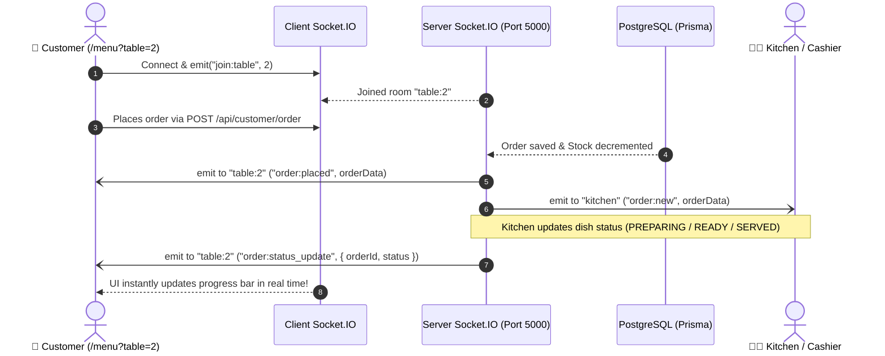

# Implementation Plan - Customer Digital Menu & Real-Time Ordering UI (with Socket.IO)

Build a modern, mobile-first Customer Ordering Interface for **Serve_Sync** powered by **Socket.IO** real-time WebSockets. When customers scan a table QR standee (or open `/menu?table=<num>`), they can browse the menu with live stock updates, place orders, and watch their orders transition through preparation phases in real time without refreshing the page.

---

## Real-Time Socket.IO Architecture & Flow

---

## User Review Required

> [!IMPORTANT]
> **Socket.IO Real-Time Channels**:
> 1. **Table Room (`table:<tableNumber>`)**: Customers subscribe to their table's room to receive instant live status changes for their orders (`PENDING` ⏳ ➡️ `PREPARING` 🍳 ➡️ `READY` 🔔 ➡️ `SERVED` ✅) and table state.
> 2. **Global Inventory Channel**: When an item's remaining quantity reaches 0 (Auto-86), a socket event `inventory:stock_update` will immediately mark the dish as "Sold Out" across all active customer menus.
> 3. **Service Calls**: "Call Waiter" and "Request Bill" send immediate socket alerts to staff screens.

---

## Proposed Changes

### 1. Backend: Real-Time Server & Customer API

#### [NEW] [socket.ts](file:///d:/Development/Restaurant-Management-System/server/src/socket.ts)
* Initialize `Socket.IO` instance attached to the HTTP server.
* Handle connections, table room subscription (`join:table`), and broadcast helpers (`emitToTable`, `emitToKitchen`, `emitStockUpdate`).

#### [MODIFY] [index.ts](file:///d:/Development/Restaurant-Management-System/server/src/index.ts)
* Wrap Express `app` with Node's native `createServer(app)`.
* Attach Socket.IO via `initSocket(httpServer)`.
* Listen on `PORT` using `httpServer.listen(...)`.

#### [NEW] [customer.controller.ts](file:///d:/Development/Restaurant-Management-System/server/src/controllers/customer.controller.ts)
* **`getPublicMenu`**: Returns all categories and available dishes with live inventory counts.
* **`getTableInfo`**: Validates table number and returns active session details.
* **`placeOrder`**:
  * Atomically validates stock, decrements `remainingQty` in `Inventory` (Auto-86 if 0).
  * Creates `Order` & `OrderItem` records tied to active `DiningSession`.
  * Emits `order:placed` to the table room and `order:new` to kitchen/staff channels via Socket.IO.
* **`getOrderStatus`**: Fetches current orders and status for a dining session.
* **`requestService`**: Emits `service:call_waiter` or `service:request_bill` to staff and updates table status to `BILLING`.

#### [NEW] [customer.routes.ts](file:///d:/Development/Restaurant-Management-System/server/src/routes/customer.routes.ts)
* `GET /api/customer/menu` - Fetch menu & categories
* `GET /api/customer/table/:tableNumber` - Check table status
* `POST /api/customer/order` - Place order
* `GET /api/customer/session/:tableNumber` - Live session orders & bill tab
* `POST /api/customer/service` - Call waiter / Request bill

#### [MODIFY] [app.ts](file:///d:/Development/Restaurant-Management-System/server/src/app.ts)
* Mount `customerRoutes` at `/api/customer`.

---

### 2. Frontend: Client Socket & Customer UI

#### [NEW] [socket.ts](file:///d:/Development/Restaurant-Management-System/client/src/lib/socket.ts)
* Socket.IO client instance connecting to `http://localhost:5000` with auto-reconnection and event listeners.

#### [NEW] [CustomerMenu.tsx](file:///d:/Development/Restaurant-Management-System/client/src/pages/customer/CustomerMenu.tsx)
The customer web application featuring:
1. **Live Connection Indicator**:
   - Subtle pulse pill (`Live Sync ⚡`) showing WebSocket connection status.
2. **Table Header & Hero**:
   - Table identifier badge (e.g. `Table 04`) or `Takeaway / Self-Pickup`.
   - "Call Waiter" and "View Orders / Bill" quick access actions.
3. **Menu Categorization & Live Search**:
   - Category pill filters with active highlights.
   - Live search input filtering dishes instantly by name and description.
4. **Dish Cards**:
   - High-quality visual cards with price, badges, and remaining stock pill.
   - Dynamic Auto-86 "Sold Out" state synced via WebSockets.
   - Quantity controls (`-` / `+`) with smooth micro-interactions.
5. **Interactive Cart Sheet / Drawer**:
   - Slide-over order review.
   - Add specific kitchen cooking instructions.
   - Real-time subtotal and tax calculation.
   - "Send Order to Kitchen" action with loading feedback.
6. **Live Order Tracker Tab**:
   - Connected directly to Socket.IO events for live status updates:
     - `PENDING` (Order sent to kitchen)
     - `PREPARING` (Chef is cooking)
     - `READY` (Plated and ready)
     - `SERVED` (On the table)
   - Running session total with "Request Bill" and "Add More Items" actions.

#### [MODIFY] [App.tsx](file:///d:/Development/Restaurant-Management-System/client/src/App.tsx)
* Register `/menu` and `/customer` routes leading to `<CustomerMenu />`.

---

## Verification Plan

### Automated / Build Verification
1. Server TypeScript compilation: `npm run build` in `server/`.
2. Client Vite build: `npm run build` in `client/`.

### Real-Time Socket Verification
1. Open customer menu in browser: `http://localhost:5173/menu?table=1`.
2. Verify WebSocket connection is established and table room `table:1` is joined.
3. Place an order: verify order is received, socket broadcasts event, and UI switches to live tracking.
4. Verify instant status updates without page reload.
